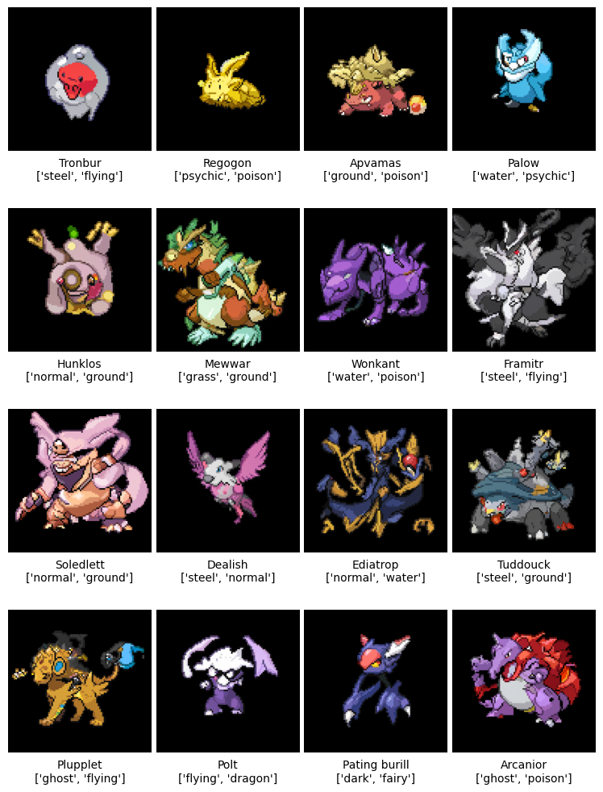
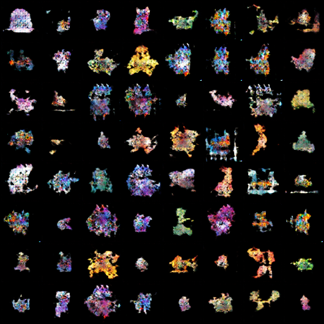
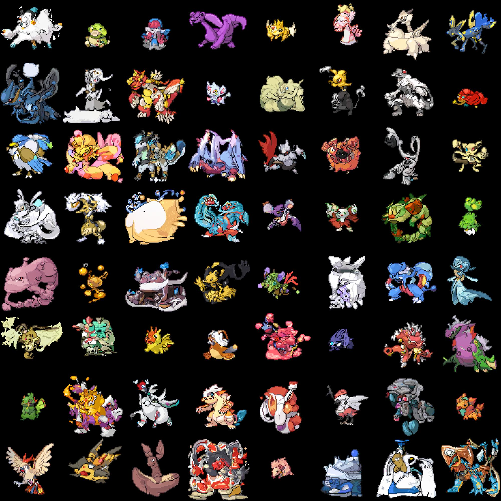
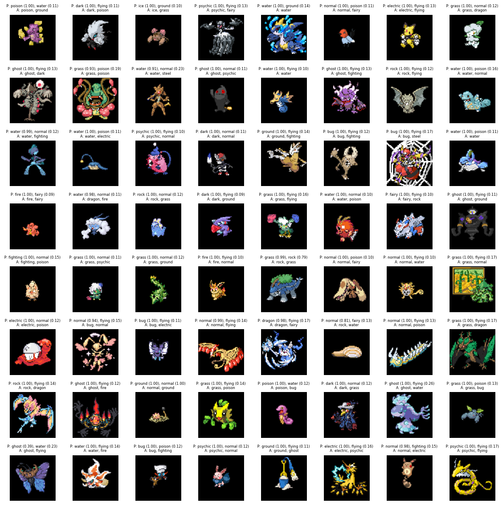

# Pokémon Generation Repository

This project explores the generation of Pokémon images using deep learning techniques, along with complementary components for type prediction and name generation. Below is an example of output from the trained diffusion model.

  

## Table of Contents
- [Overview](#overview)
- [Image Generation](#image-generation)
- [Type Prediction](#type-prediction)
- [Name Generation](#name-generation)

## Overview
This repository contains a framework for generating unique Pokémon sprites, predicting their types, and generating unique names. Initially, Generative Adversarial Networks (GANs) were used for image generation. Later iterations leverage diffusion models for improved quality and diversity of generated images.
Additionally, LSTM is used name generation and a CNN for type prediction.

## Image Generation: 
  - **Dataset**
      - Previous attempts for pokemon image generation were limited to the official pokemon dataset, which is about 1,025. This is limiting for deep learning as huge ammounts of data is needed. I aimed to address this issue by training a model on the sprites from the popular fan game [Pokemon Infinite Fusion](https://infinitefusion.fandom.com/wiki/Pok%C3%A9mon_Infinite_Fusion_Wiki). Of which, there is over 100,000 unique sprites. These sprites were created by fans, and as I didn't receive permission to train on their images, I don't plan to release the model weights nor do I plan to utilize these images in any way other than a proof-of-concept.
        
  - **GAN-based image generation for initial experiments**
      - My initial attempts utilized a Generative Adversarial Network (GAN) for image generation. I had no prior experience in deep learning (and minimal experience in machine learning) at this point. GANs are a pain to get working, and I am sure that my implementation, which is really just repurposed code from [Justin Kleiber's implementation](https://github.com/jkleiber/PokeGAN), did not properly address the complexities of the problem. The end results were quite poor, and left me considering potential next steps.

  
  

  - **Diffusion model-based generation for enhanced results**
      - The failure of the GAN implementation led me to consider [improved-diffusion](https://github.com/openai/improved-diffusion). Diffusion based techniques have been proven as a superior method to GANs (https://arxiv.org/abs/2105.05233), and it seemed like a logical next step in this process. This model was trained for 3 weeks on a A100 GPU on 256x256 images, and the results were much better.

  

      
## Type Prediction:
  - Pokemon image-based type prediction has been tackled before. I encountered a lot of pain trying to get this component working. As of now, I don't think its adequete enough to be included, but I update this later. The following image is type-prediction on training images from the pokemon infinite fusion dataset. 

  

    
## Name Generation:
  - Names were generated with a RNN (LSTM) based on the code from https://github.com/simon-larsson/pokemon-name-generator/tree/master. I expanded the dataset and changed some code of the code to try and produce better results.

| Name           | Name          | Name          | Name         |
|----------------|---------------|---------------|--------------|
| Coptry         | Ecidoede      | Wailencosce   | Ilt          |
| Boldic         | Slikoudu      | Dramonduza    | Wearop       |
| Pudscee        | Irin jurudon  | Tepido        | Leadabiti    |
| Bramble        | Marano        | Swellion      | Kolluck      |
| Zorial         | Sardas        | Cunschoe      | Kigliwel     |

  
